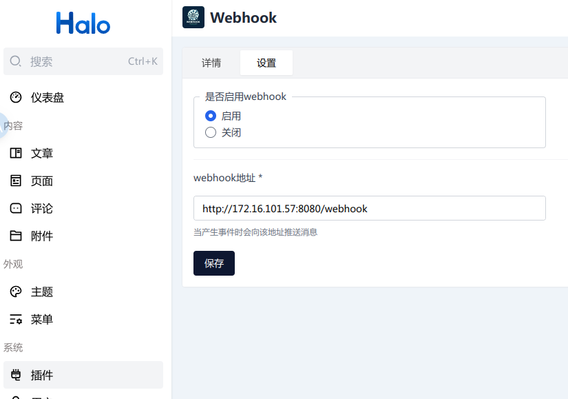

# halo-plugin-webhook

# 请使用[最新版本](https://github.com/wxyShine/plugin-webhook) 该版本已停止开发

## 🎟️简介

`halo-plugin-webhook` 是一个为 [Halo](https://halo.run/) （一款流行的博客系统）设计的Webhook插件。该插件允许用户在特定事件发生时（如文章发布、更新等）发送通知到指定的Webhook URL。

## ✨功能

- **事件触发**：当在Halo中发生特定事件（如创建、更新、删除文章）时，触发Webhook调用。
- **灵活配置**：用户可以配置Webhook URL
- **简单集成**：易于在现有的Halo博客系统中集成和使用。

## 💻安装
如何安装和配置`halo-plugin-webhook`插件。

1. 下载，目前提供以下下载方式：
    GitHub Releases：访问 [Releases](https://github.com/wxyShine/halo-plugin-webhook/releases) 下载 Assets 中的 JAR 文件。  
安装，插件安装和更新方式可参考：https://docs.halo.run/user-guide/plugins  
安装完成之后，记得启用插件并完成相关配置。

## 📒[TODO](https://github.com/wxyShine/halo-plugin-webhook)
- [ ] 更多事件支持。  
- [ ] 用户可以选择配置关注的事件类型。   
...

## ✍️贡献
如果您有兴趣为halo-plugin-webhook贡献代码或文档，欢迎Fork本仓库并提交[Pull Request](https://github.com/wxyShine/halo-plugin-webhook/pulls)。

## ⛓️支持
如果您在使用halo-plugin-webhook时遇到任何问题，可以通过以下方式寻求帮助：

提交[GitHub Issue](https://github.com/wxyShine/halo-plugin-webhook/issues)。
